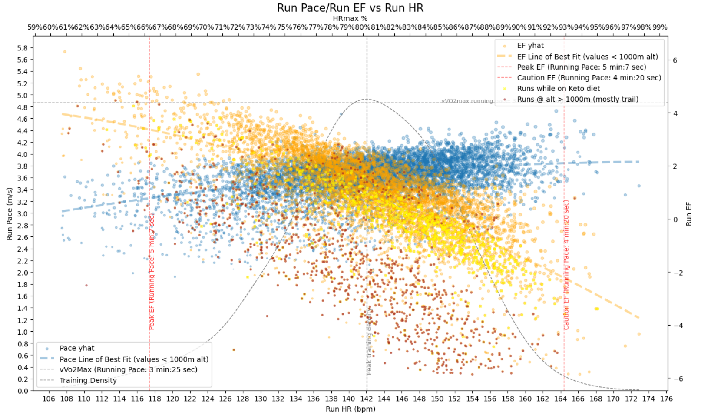

# Optimizing Running Performance and Efficiency with Neural Network Models

This notebook is a tool for analyzing and improving the performance of a running athlete. It starts by calculating different performance metrics, including VO2max (a measure of aerobic fitness) adjusted for altitude, vVo2Max (running pace at VO2Max), activity running speed adjusted for gradient, and the running efficiency factor (Running efficiency predictor). These values are combined with other information, such as HR (Running HR), Altitude, TSS (Training Stress Score and Distance.

The combined dataset is then used to train a neural network model (RandomForestRegressor) to determine the "Peak performance zone," in which the athlete performs most efficiently, and the "Caution zone," where they perform less efficiently. The corresponding training intensities (Running HR/Running Pace) are also identified. The results are visualized through scatter plot, along with efficiency lines, to facilitate analysis.

The aim of this notebook is to assist the athlete in determining the best training intensities and volume, as well as to inform tapering before races, in order to achieve optimal performance and training adaptation. The data used for analysis was obtained from a single master's athlete over a period of 6 years and covers various training intensities, terrains, altitudes, and nutritional interventions. The data was retrieved from the "Athlete Data Warehouse" PostgreSQL database, which integrates athletic activity and lifestyle information from various sources, and was exported into a CSV file included with this notebook.

*Scatter Plot EF/Pace vs HR/%HRmax:*

Resources:
* https://github.com/pgalko/athlete_data_warehouse
* https://alancouzens.com/blog/Banister_v_Neural_Network.html,
* https://www.academia.edu/18970413/Heart_Rate_Running_Speed_index_May_Be_an_Efficient_Method_of_Monitoring_Endurance_Training_Adaptation,
* https://www.runnersworld.com/training/a20829802/tracking-fitness-with-the-heart-rate-running-speed-index/,
* https://dyrts.fr/en/posts/vvo2max/,
* https://pickletech.eu/blog-gap/,
* https://educatedguesswork.org/posts/grade-vs-pace/
